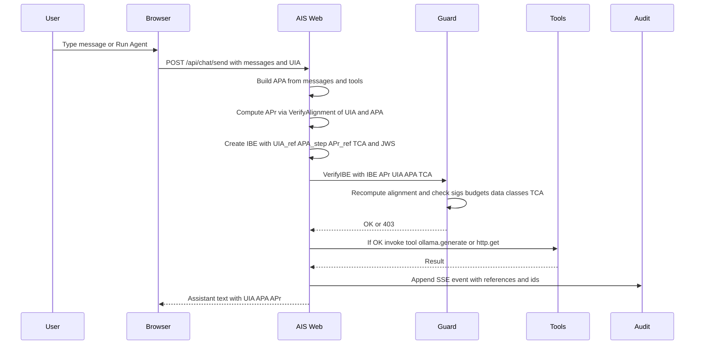

## AIS Demo (Agentic Intent Security) — Intent‑Bound LLM Calls with Ollama

This demo shows a minimal implementation of Agentic Intent Security (AIS):
- Capture user intent (UIA)
- Generate an agent plan (APA) and alignment proof (APr)
- Bind each tool/API call with an Intent‑Bound Envelope (IBE)
- Enforce alignment and constraints before calling a local LLM (Ollama)

### Features
- Dark ChatGPT-like chat UI (intent side panel, model selector, agent steps editor)
- UIA (intent), APA (plan), APr (alignment) preview; UIA editable in-place (CodeMirror)
- IBE (Intent‑Bound Envelope) per tool call, signed with JWS HS256 (demo)
- Guard verifies freshness, alignment threshold, risk budgets, data‑class and TCA compatibility
- Ollama integration with blocking progress overlay and local model preference
- Model picker fed by `/model/list`; switches via `/model/select`
- Configurable agentic chain (JSON). Includes `ollama.generate` and `http.get` tools
- Live Audit panel (SSE) showing each enforced call (UIA/APA/APr refs, IBE id, tool)

---

## Quickstart

### Option A: Docker Compose (recommended)

Requirements:
- Docker Desktop or Docker Engine

Steps:
```bash
cd ais-demo
docker compose up --build
```

Open http://localhost:8890 in your browser.

The compose file starts two services:
- `ollama` on port 11434
- `aisdemo` on port 8890 (points to `http://ollama:11434`)

Environment variables (configured in `docker-compose.yml`):
- `OLLAMA_URL` (default `http://ollama:11434`)
- `OLLAMA_MODEL` (default `llama3`)
- `AIS_SECRET` (JWS HS256 key; demo default)

To change the model, edit `OLLAMA_MODEL` and rebuild/restart.

### Option B: Local (no Docker)

Requirements:
- Go 1.23+
- Ollama running locally (default `http://localhost:11434`) with a model (e.g., `llama3`)

Steps:
```bash
cd ais-demo
go run ./cmd/aisdemo
```

Optional environment variables:
```bash
export OLLAMA_URL=http://localhost:11434
export OLLAMA_MODEL=llama3
export AIS_SECRET=dev-secret-change-me
```

Open http://localhost:8890.

---

## How to Use
- Chat: type a message; intent (UIA) and plan (APA/APr) appear in the Intent panel; tool calls are enforced via IBE.
- Intent editor: tweak UIA JSON directly; use Re‑Plan to regenerate APA/APr before sending.
- Agent chain: open Intent panel → “Agent Steps” and edit JSON:
  - Example: `[ { "tool": "http.get", "url": "https://example.com" }, { "tool": "ollama.generate", "prompt": "Summarize the page" } ]`
  - Click Run Agent: each step runs through UIA→APA/APr→IBE guard with Audit events.
- Model: use the dropdown to pick a present model; the UI pulls a default only if none exist.
- Audit: click Audit to view live SSE events (JSON lines).

---

## Architecture



Legend:
- UIA: User Intent Assertion (why/what + constraints, risk budget)
- APA: Agent Plan Assertion (steps, expected effects, alignment)
- APr: Alignment Proof (method + evidence {coverage, risk})
- IBE: Intent‑Bound Envelope (per‑call, signed, includes refs + expiry)
- TCA: Tool Capability Attestation (server‑declared effects)

Key components:
- `internal/ais/types.go`: UIA/APA/APr/IBE/TCA types
- `internal/ais/signing.go`: JWS HS256 signing helpers (demo only)
- `internal/ais/guard.go`: guard enforcing freshness/alignment/risk/data‑class/TCA
- `internal/ais/ollama.go`: Ollama client + model discovery/pull streaming
- `internal/ais/http_tool.go`: simple http.get tool
- `cmd/aisdemo/main.go`: web UI, endpoints, audit SSE

---

## Configuration
- `OLLAMA_URL`: base URL of the Ollama server (default `http://ollama:11434`)
- `OLLAMA_MODEL`: model name to use (default `llama3`)
- `AIS_SECRET`: symmetric key for JWS HS256 (demo default; change for any non‑local use)

---

## Security Notes
- Demo JWS HS256 is for illustration; for production use JWS/VC/SD‑JWT with proper key mgmt/rotation.
- IBE signatures include freshness (nonce/expiry). Do not reuse nonces; keep expiry short.
- The guard enforces alignment threshold, risk budgets, and compatibility checks before any tool call.

---

## License and Notices
- License: see the repository’s `LICENSE` file for full terms.
- Third‑party: see `THIRD_PARTY_NOTICES.md` (or equivalent notices file) for attributions and license details of bundled/used components (e.g., Ollama, CodeMirror, and other dependencies).
- Copyright: as specified in the repository copyright notice.


